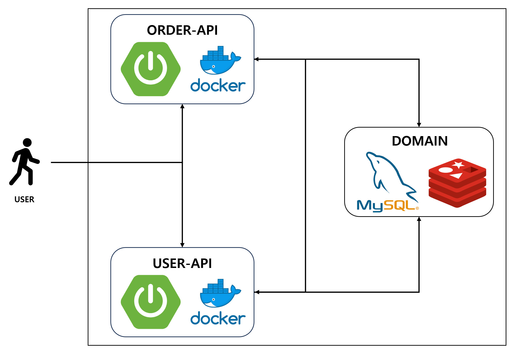
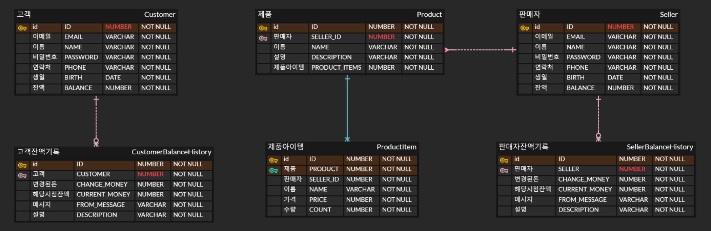

# 이커머스 프로젝트

## 개요
간단한 커머스 프로젝트

기술스택 : Spring 3.2.1, Java 17, Jpa, Mysql, Redis, Docker, AWS

목표 : 판매자와 구매자 사이를 중계해 주는 커머스 서버를 구축한다

## 회원 서버
### 공통
- [x] 회원가입
- [x] 인증
- [x] 로그인 토큰 발행
- [x] 로그인 토큰을 통한 제어 확인
- [x] 예치금 관리

## 주문 서버

### 판매자
- [x] 상품 등록, 수정
- [x] 상품 삭제

### 구매자
- [x] 장바구니를 위한 Redis 연동
- [x] 상품 검색 & 상세 페이지
- [x] 장바구니에 물건 추가
- [x] 장바구니 확인
- [x] 장바구니 변경
- [x] 주문하기

## Trouble Shooting
[go to the trouble shooting section](doc/TroubleShooting.md)

## 시스템 구성

## ERD

### Tech Stack

 
   
  
   
  
  
  
  

